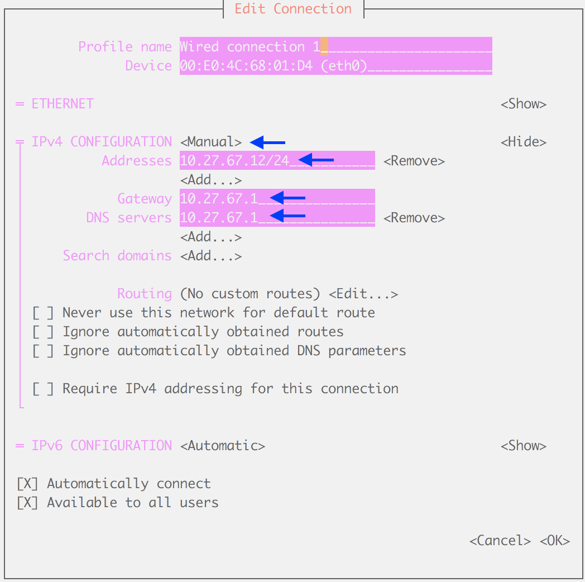

************
Installation
************

This page describes how to prepare a Jetson Nano with Deadeye on it. You may install Deadeye on multiple systems such as another Nano, macOS or Linux -- just be sure to give each a different unit ID (A, B, C, etc.).

.. contents:: Topics

Jetson Nano Developer Kit
=========================

When you boot the first time from a freshly-imaged SD card, the Jetson Nano Development Kit will take you through some initial set-up. Normally this is done with an attached monitor, keyboard and mouse, but for convenience we will perform a "headless" set-up over a USB serial connection.

Items Required
--------------

Have the following items available before starting installation.

**microSD Card**
    The Jetson Nano uses a microSD card as a boot device and for main storage. It’s important to have a card that’s fast and large enough for your projects; the minimum recommended is a 16GB UHS-1 card.

**5V 4A Power Supply**
    Normally the Nano is powered via the micro-USB connector, however we will be using it for serial communication during set-up. You'll need to power the Nano with a DC barrel jack power supply (with 5.5mm OD / 2.1mm ID / 9.5mm length, center pin positive) that can supply up to 5V 4A. See `Adafruit’s 5V 4A switching power supply <https://www.adafruit.com/product/1466>`_.

**Circuit Board Jumper Cap**
    To enable use of the DC barrel jack power supply, you will need to fit a jumper to J48 on the Nano baseboard.

**USB Cable**
    You will use a micro-USB to USB A cable to connect to the Jetson Nano. Make sure that the cable is data capable. Some USB cables (such as those that come with phones) only transmit power.

**Ethernet Cable**
    For connecting to your network.

First Boot
----------

.. note:: Start with the Jetson Nano unpowered; we will connect to power supply in a step below.

#. Download the `Jetson Nano Developer Kit SD Card image <https://developer.nvidia.com/embedded/jetpack>`_ and install it to your microSD card using `balenaEtcher <https://www.balena.io/etcher/>`_ or equivalent.

#. Install the microSD card into the slot on the underside of the Jetson Nano module.

#. Connect the USB cable between your computer and the Nano micro-USB connector.

#. Connect the ethernet cable to your network.

#. Attach the circuit board jumper cap across **J48**.

#. Attach the 5v power supply to the **J25 power jack** to boot the Jetson Nano.

#. When boot is complete, connect to the Jetson Nano via USB serial.  You will need a serial terminal application such as **puTTY** for Windows or **screen** for Linux and macOS. More information about connecting with a serial terminal can be found at `JetsonHacks <https://www.jetsonhacks.com/2019/08/21/jetson-nano-headless-setup/>`_.

Initial Set-up
--------------

When you boot the first time, the Jetson Nano Developer Kit will take you through some initial setup, including:

#. Review and accept NVIDIA Jetson software EULA

#. Select system language, location, and time zone

#. System clock set to UTC: **Yes**

#. User full name: **Deadeye**

#. Username: **deadeye**

#. Password: *use shop WiFi password*

#. APP partition size: accept default value to use entire SD card

#. Network configuration: select **eth0** as the primary network interface. If you are connected to a network via ethernet, you should be assigned an IP address using DHCP. We will configure a static IP address below.

#. Select a host name corresponding to the unit ID, for example, unit A is **deadeye-a**.

Network Configuration
=====================

For team 2767, computer name and IP address are according to the following table:

    ==== =========  ===========
    Unit Hostname   IP Address
    ==== =========  ===========
    A    deadeye-a  10.27.67.10
    B    deadeye-b  10.27.67.11
    C    deadeye-c  10.27.67.12
    D    deadeye-d  10.27.67.13
    ==== =========  ===========

The gateway and DNS server are **10.27.67.1** for all units.

To set a static IP address, log in as user **deadeye** and run ``sudo nmtui`` at the command prompt to enter the network configuration utility. Select to edit **Wired Connection 1** and configure according to the table above. For example, deadeye-c would be configured as below:

Reboot the Jetson Nano using ``sudo reboot`` and confirm you can log in remotely from your computer via SSH: ``ssh deadeye@10.27.67.12`` (deadeye-c).

Miscellaneous
=============

Update installed packages:

.. code-block:: shell-session

    $ sudo apt upgrade

To use Ansible later we need to allow use of ``sudo`` without password:

.. code-block:: shell-session

    $ sudo visudo
    $ # then edit the following line to read
    %sudo   ALL=(ALL:ALL) NOPASSWD:ALL

Disable the graphical boot:

.. code-block:: shell-session

    $ sudo systemctl set-default multi-user.target
