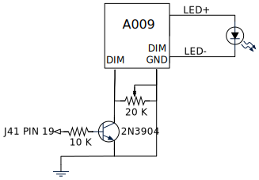
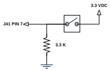

.. _sect_intro:

************
Introduction
************

Software
========

The Deadeye system has several components that run on the Jetson Nano, client roboRIO and web browser. They communicate over the network and require a running `NetworkTables <https://docs.wpilib.org/en/stable/docs/software/networktables/>`_ server.

**deadeye-daemon**
    The main vision processing process running on the Jetson Nano that manages cameras and associated target processing pipelines.
    
    It communicates via NetworkTables for configuration and control and via UDP to a **deadeye-java** client that uses streaming targeting data. It also provides an on-demand camera video stream directly to **deadeye-web** over TCP.

**deadeye-java**
    Client Java libary used by FRC roboRIO robot code to control and communicate with **deadeye-daemon**.
    
    It communicates via NetworkTables for configuration and control and to **deadeye-daemon** directly via UDP for streaming target data.

**deadeye-admin**
    A Python web service running on the Jetson Nano that is the backend for the web-based administration dashboard, **deadeye-web**, that configures and controls **deadeye-daemon**.
    
    It communicates with **deadeye-daemon** via NetworkTables and with **deadeye-web** over websockets.

**deadeye-web**
    The web-based adminstration dashboard run on a developer's computer used to control, configure and monitor **deadeye-daemon**.
    
    It communicates with **deadeye-admin** over websockets and streams camera video directly from **deadeye-deadeye** over TCP.

**deadeye-shutdown**
    A background service running on the Jetson Nano that watches for a shutdown button press and performs a clean shutdown if it pressed for three or more seconds.

Hardware
========

Deadeye software is designed to interact with cameras, lights and a shutdown switch attached to the Jetson Nano.

Camera
------

Any camera(s) supported by the Jetson Nano can be used. Deadeye supports up to five attached cameras per unit. Our default camera is a `Raspberry Pi Camera Module V2 <https://www.raspberrypi.org/products/camera-module-v2/>`_ connected to the Jetson Nano ``J13 camera connector``.

Lights
------

Our default vision processing pipeline relies on bright green LED illumination reflected by retro-reflective target tape back to the camera.

We drive the green LEDs using a LUXdrive A009-D-V-1000 BuckBlock LED driver module.

   Camera Lights Driver Circuit

Each camera can have its own light driver circuit and has GPIO output assigned per table below.

.. table:: J41 GPIO Pins    
    :align: center
    :widths: auto

    ====== =======
    Camera Pin
    ====== =======
    0      19
    1      21
    2      23
    3      24
    4      26
    ====== =======

Shutdown Switch
---------------

The **deadeye-shutdown** daemon checks ``GPIO pin 7`` of the ``J41`` header every second and will initiate a system shutdown if the input is pulled high by the shutdown switch for three consecutive seconds.

   Shutdown Switch Circuit