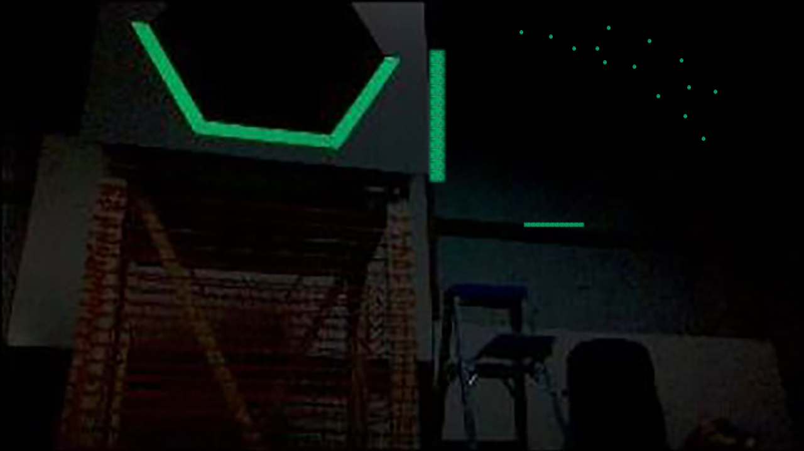
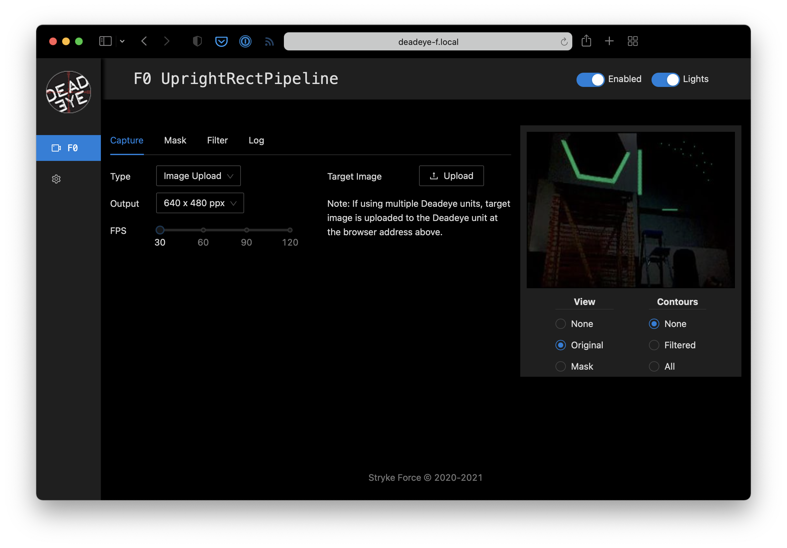
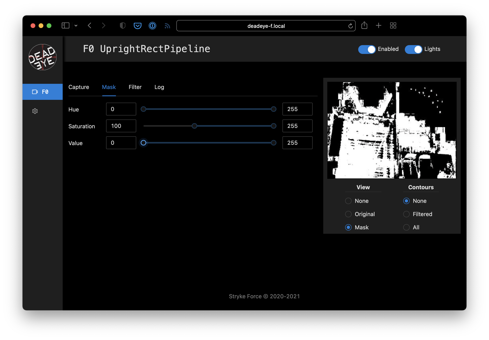
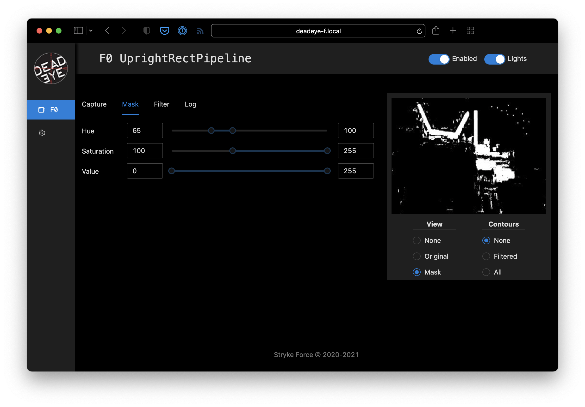
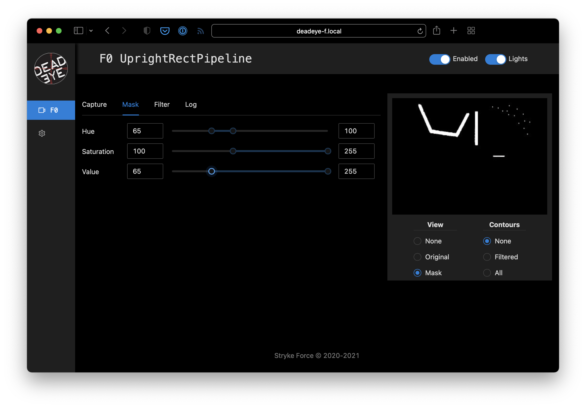
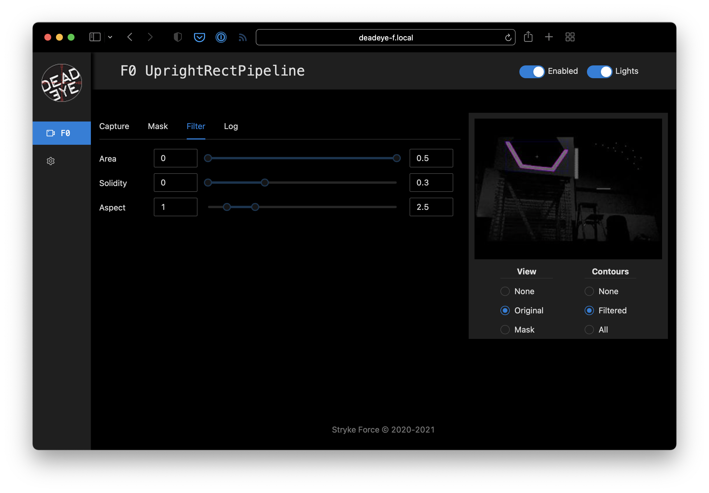
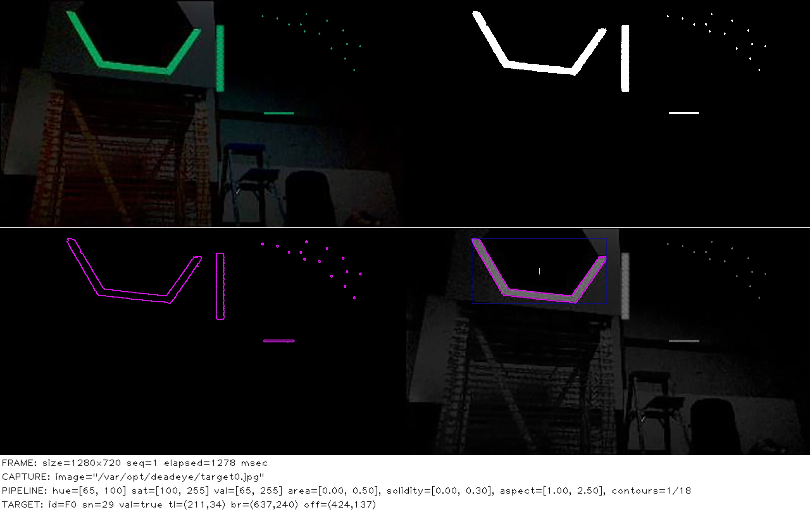
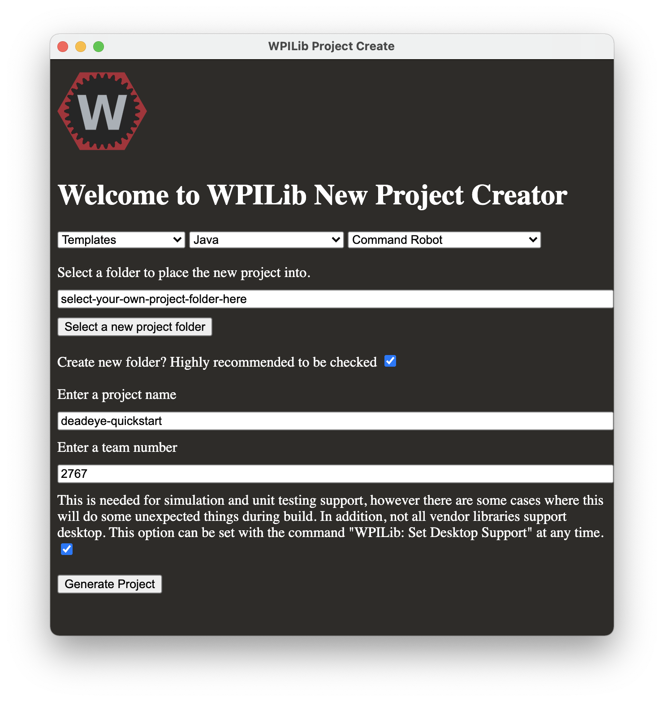

**********
Quickstart
**********

This section gets you started using Deadeye with a FRC robot program. It will
work on either a robot or the `robot simulator
<https://docs.wpilib.org/en/latest/docs/software/wpilib-tools/robot-simulation/index.html>`_
available on your development workstation.

.. toctree::
   quickstart

In this example, we'll upload this target `test image <_images/target.jpg>`_ to
Deadeye. To make things interesting, this image includes extra retro-reflective
tape reflections ("noise") that will need to be filtered out to isolate the target
correctly.

   test target image

Configure Vision Pipeline
=========================

This example assumes you have a Deadeye unit configured with the
``UprightRectPipeline`` and you can access its admin dashboard from your
browser.

.. note:: The quickstart pipeline tuning process outline below is good enough
   for our single target test image. Real-world usage requires more careful
   tuning that takes into account varying field positions and lighting
   conditions.

Image Capture
-------------

Start by using :menuselection:`Capture --> Type --> Image Upload` dashboard
option to upload a `test image <_images/target.jpg>`_ of a target.

Mask Target
-----------

.. todo:: make these glossary terms

Aquire *contours* that surround target reflections by adjusting the pipeline
*mask* parameters. 

.. note:: You can make the *hue*, *saturation*, and *value* adjustments in any
   order, but we usually adjust value last and keep as wide a value range as
   possible to account for different target viewing distances.

Since the reflected light from the retro-reflective tape is a saturated color
we start by adjusting the :menuselection:`Mask --> Saturation` lower bound.
While watching the preview, increase the lower bound to a value that starts to
remove low-saturation pixels but retains all the target pixels that we are
interested in.

   Mask Saturation lower bound set to 100.

We use a specific green-colored light to illuminate the target so we can filter
out other colors by adjusting the :menuselection:`Mask --> Hue` lower and upper
bounds until just before the target pixels start to disappear.

   Mask Hue bounds set to 65—100.

Finally, since the retro-reflective target tape creates a bright reflection, we
adjust the :menuselection:`Mask --> Value` lower-bound to remove dim pixels and
clean up the reflected target mask.

   Mask Value lower bound set to 65.

Filter Contours
---------------

Our masked test target image contains spurious contours that need to be
filtered out. Set :menuselection:`Preview --> Contours --> Filtered` and
adjust the filters until you just have a single contour around the target left.

.. note:: When tuning filters for an actual robot, some of the filter
   parameters may be affected by camera viewing angle and distance as the robot
   moves around the field. Be sure to test thoroughly!

   Contour aspect ratio and solidity filters adjusted.

Pipeline Logging
----------------

Logging can be enabled in the dashboard to assist troubleshooting during
competitions. Here's an example of logging output from the pipeline we just
configured.

   Deadeye pipeline *four-up* logging output.

Create Robot Project
====================

Deadeye provides a Java client library that can be used in FRC robot programs
to control and receive data from a Deadeye vision co-processor. In this
example, we'll use this library to connect to the Deadeye pipeline we just
configured and print out data about the sample image's target.

Create Project
--------------

We'll assume you are using `VS Code with the WPILib extension
<https://docs.wpilib.org/en/stable/docs/software/vscode-overview/>`_.

See the WPILib VS Code instructions for `creating a robot program
<https://docs.wpilib.org/en/stable/docs/software/vscode-overview/creating-robot-program.html>`_
and use the following settings for the **New Project Creator**:

   Deadeye quickstart example New Project Creator settings

Add Deadeye Library
-------------------

For FRC robot projects, the Deadeye client library is provided via a vendordeps
file:

.. object:: deadeye.json

   Download from: http://maven.strykeforce.org/deadeye.json

To install, use :menuselection:`VS Code --> Install new libraries (online)` and
provide the :file:`deadeye.json` URL above.

Alternatively, you can install manually to your project vendordeps directory or
run the following Gradle task in your project directory to download and install
the Deadeye vendor dependency file:

.. code-block:: console

    $ ./gradlew vendordep --url=http://maven.strykeforce.org/deadeye.json

Robot Example
=============

We can now program our robot to access the Deadeye vision pipeline we just
configured above. Since the example above is a ``UprightRectPipeline`` for
Deadeye camera ``F0`` (seen at top of admin dashboard page), we'll use this
information when programming our robot below.

Deadeye Camera Class
--------------------

The recommended way to use the Deadeye client library is to create a class that
represents each Deadeye camera, ``DeadeyeF0`` in our case.

Pipelines are designed to be used with their corresponding ``TargetData`` type,
so our ``deadeye::UprightRectPipeline`` uses a ``UprightRectTargetData``:

Create :file:`src/main/java/frc/robot/subsystems/DeadeyeF0.java` with the
following:

.. code-block:: Java
   :linenos:

    public class DeadeyeF0 implements TargetDataListener<UprightRectTargetData> {

      private final Deadeye<UprightRectTargetData> deadeye;

      public DeadeyeF0() {
        deadeye = new Deadeye<>("F0", UprightRectTargetData.class);
        deadeye.setTargetDataListener(this);
      }

      public DeadeyeF0(NetworkTableInstance nti) {
        deadeye = new Deadeye<>("F0", UprightRectTargetData.class, nti);
        deadeye.setTargetDataListener(this);
      }

      public void setEnabled(boolean enabled) {
          deadeye.setEnabled(enabled);
      }

      @Override
      public void onTargetData(UprightRectTargetData data) {
          Point center = data.center;
          System.out.printf("x=%d, y=%d %n", center.x, center.y);
      }
    }

**Lines 5-8:**

  Create a new ``Deadeye`` object instance that will expect
  ``UprightRectTargetData`` from camera ``F0`` and that uses the default
  ``NetworkTablesInstance``.

  Register this object as the designated ``TargetDataListener`` for camera
  ``F0``.

**Lines 10-13:**

  Alternate constructor you may use if you are not using the default
  ``NetworkTablesInstance``. Normally this is *only* needed when you are using
  a Deadeye or robot simulator and you are using a separate stand-alone
  ``NetworkTablesInstance`` for Deadeye. This `repo
  <https://github.com/strykeforce/olympics/tree/main/vision>`_ contains an
  example of how to use.

**Lines 15-17:**

  Enabled or disable camera ``F0`` pipeline. When enabled, the camera lights
  will turn on and the pipeline will send target data.

**Lines 19-23:**

  Implements ``TargetDataListener.onTargetData()`` and is called for every
  camera frame processed through ``F0`` pipeline. This example implementation
  extracts the target center point and prints it.

Robot Class
-----------

Normally you would integrate the camera ``DeadeyeF0`` class above into a robot
``Subsystem`` and activate from a ``Command`` but we'll keep it simple for the
purposes of this example.

Make the following additions to the standard ``Robot`` class in
:file:`src/main/java/frc/robot/Robot.java`.

Initialize our robot's ``DeadeyeF0`` object in the ``robotInit()`` method.

.. code-block:: Java
   :linenos:
   :emphasize-lines: 6

   private DeadeyeF0 deadeyeF0;

   @Override
   public void robotInit() {
     // ...
     deadeyeF0 = new DeadeyeF0();
   }

Enable camera ``F0`` when enabling the robot in tele-operation mode.

.. code-block:: Java
   :linenos:
   :emphasize-lines: 4

   @Override
   public void teleopInit() {
     // ...
     deadeyeF0.setEnabled(true);
   }

And disable the camera when disabling the robot.

.. code-block:: Java
   :linenos:
   :emphasize-lines: 3

   @Override
   public void disabledInit() {
     deadeyeF0.setEnabled(false);
   }

Deploy and Run
--------------

If your pipeline is tuned as above you should see target data for the sample
image large target in the **robot log** when you enable the robot.

.. code-block::

   x=212, y=91
   x=212, y=91

