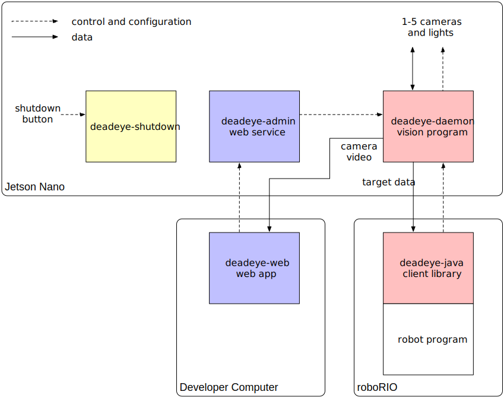
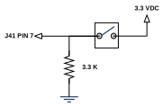

# Architecture

Deadeye consists of software and hardware that together provide a vision
processing system for FRC robots. The main system components are identified in
the block diagram below. In addition to the main vision processing pipeline
shown in red, we have an adminstration dashboard in blue, and miscellaneous
services in yellow.

Although typically used on a [Jetson Nano Developer Kit][jndk], the Deadeye
server software (vision process daemon and admin dashboard web server) can be
installed on any Linux system with the appropriate C++ compiler and development
libararies installed.

[jndk]: https://developer.nvidia.com/EMBEDDED/jetson-nano-developer-kit/

## Software

The Deadeye system has several components that run on a vision coprocessor,
client roboRIO and web browser. They communicate over the network and require a
running [NetworkTables][nt] server.

[nt]: https://docs.wpilib.org/en/stable/docs/software/networktables/

### Camera Pipeline Daemon

The main vision processing process running on the vision coprocessor that
manages up to five cameras and associated target processing pipelines. Each
running instance is identified by a unit ID: A, B, C...

Communication is via NetworkTables for configuration and control via the [web
admin dashboard server](#web-admin-dashboard-server) and the [Java client
library](#java-client-library) and via UDP for streaming targeting data to the
Java client library. It also provides an on-demand camera video stream directly
to the [web admin dashboard client](#web-admin-dashboard-client) over TCP.

It runs as a systemd service named `deadeye-daemon.service`.

### Java Client Library

A Java client libary ([javadocs](javadoc/)) used by FRC roboRIO robot code to
control and communicate with the [camera pipeline
daemon](#camera-pipeline-daemon) running on the vision co-processor.
Communication to other components is via NetworkTables for configuration and
control and to the camera pipeline daemon directly via UDP for streaming target
data.

See the [Quickstart](quickstart/robot.md#add-deadeye-library) for installation
and usage instructions.

### Web Admin Dashboard Server

A Python web service running on the Nano that is the backend for the [web admin
dashboard client](#web-admin-dashboard-client), that configures and controls
the [camera pipeline daemon](#camera-pipeline-daemon).

Communication with the camera pipeline daemon is via NetworkTables and with the
web admin dashboard client via a websocket using the [Socket.IO][socketio]
protocol.

[socketio]: https://socket.io

It runs as a systemd service named `deadeye-admin.service`.

### Web Admin Dashboard Client

The web-based adminstration dashboard run on a developer's computer used to
control, configure and monitor the [camera pipeline
daemon](#camera-pipeline-daemon).

It communicates with the [web admin dashboard
server](#web-admin-dashboard-server) over websockets and streams camera preview
video directly from the camera pipeline daemon over TCP as MJPEG.

It can be loaded by connecting with a web browser to port 5000, for example,
<http://10.27.67.10:5000/>.

### Shutdown Service

A background service running on the Nano that watches for a [shutdown
button](#shutdown-switch) press and performs a clean shutdown if it pressed for
three or more seconds.

It runs as a systemd service named `deadeye-shutdown.service`.

## Hardware

Deadeye software is designed to interact with cameras, lights and a
shutdown switch attached to the Jetson Nano.

### Camera

Any camera(s)
[supported](https://developer.nvidia.com/embedded/jetson-partner-supported-cameras)
by the Nano can be used. Deadeye supports up to five attached cameras per unit.
Our default camera is a [Raspberry Pi Camera Module
V2](https://www.raspberrypi.org/products/camera-module-v2/) connected to the
`J13 camera connector`.

### Lights

Our default vision processing pipeline relies on bright green LED
illumination reflected by retro-reflective target tape back to the
camera.

We drive the green LEDs using a LUXdrive A009-D-V-1000 BuckBlock LED
driver module.

Each camera can have its own light driver circuit and has GPIO output
assigned per table below.

| Camera | J41 Pin |
| ------ | ------- |
| 0      | 19      |
| 1      | 21      |
| 2      | 23      |
| 3      | 24      |
| 4      | 26      |

### Shutdown Switch

The [shutdown service](#shutdown-service) daemon checks `GPIO pin 7` of the
Nano `J41` header every second and will initiate a system shutdown if the input
is pulled high by the shutdown switch for three consecutive seconds.

