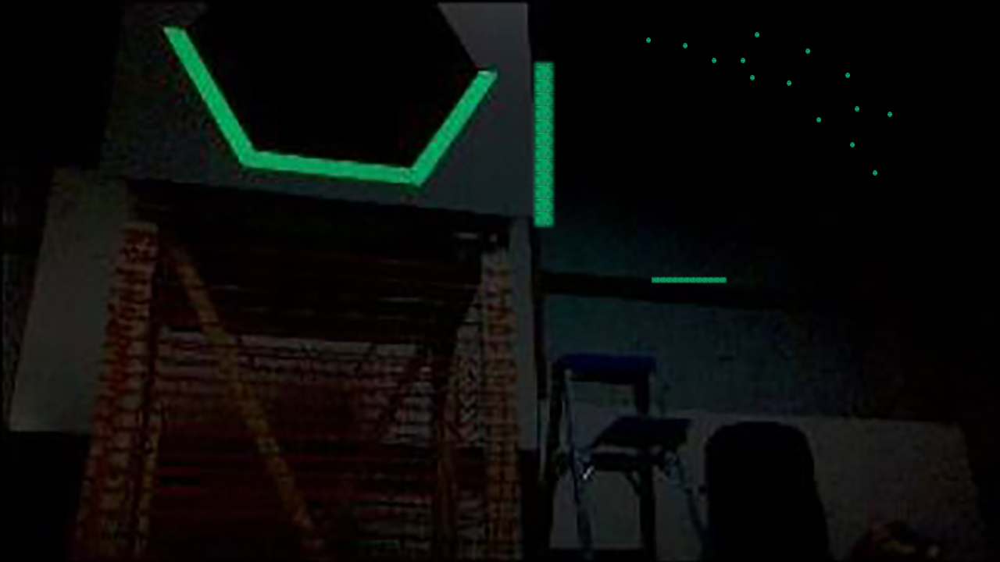

# Quickstart

This section gets you started using Deadeye with a FRC robot program. It will
work on either a robot or the [robot simulator][sim] available on your
development workstation.

[sim]: https://docs.wpilib.org/en/latest/docs/software/wpilib-tools/robot-simulation/index.html

In this example, we\'ll upload this target [test image](images/target.jpg) to
Deadeye. To make things interesting, this image includes extra retro-reflective
tape reflections ("noise") that will need to be filtered out to isolate the
target correctly.

