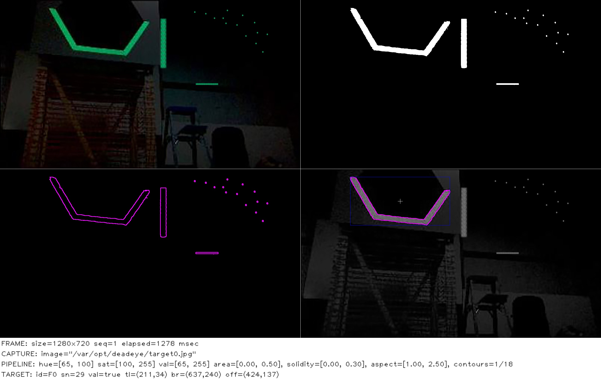

## Configure Vision Pipeline

This example assumes you have a Deadeye unit configured with the
`UprightRectPipeline` and you can access its admin dashboard from your browser.

> Note: The quickstart pipeline tuning process outline below is good enough for
> our single target test image. Real-world usage requires more careful tuning
> that takes into account varying field positions and lighting conditions.

### Image Capture

Start by using _Capture ➔ Type ➔ Image Upload_ dashboard option to upload a
[test image](../images/target.jpg) of a target.

### Mask Target

Aquire contours that surround target reflections by adjusting the pipeline
mask parameters.

> Note: You can make the _hue_, _saturation_, and _value_ adjustments in any
> order, but we usually adjust value last and keep as wide a value range as
> possible to account for different target viewing distances.

Since the reflected light from the retro-reflective tape is a saturated color
we start by adjusting the _Mask ➔ Saturation_ lower bound. While watching the
preview, increase the lower bound to a value that starts to remove
low-saturation pixels but retains all the target pixels that we are interested
in.

We use a specific green-colored light to illuminate the target so we can filter
out other colors by adjusting the _Mask ➔ Hue_ lower and upper bounds until
just before the target pixels start to disappear.

Finally, since the retro-reflective target tape creates a bright reflection, we
adjust the _Mask ➔ Value_ lower-bound to remove dim pixels and clean up the
reflected target mask.

### Filter Contours

Our masked test target image contains spurious contours that need to be
filtered out. Set _Preview ➔ Contours ➔ Filtered_ and adjust the filters until
you just have a single contour around the target left.

> Note: When tuning filters for an actual robot, some of the filter parameters
> may be affected by camera viewing angle and distance as the robot moves
> around the field. Be sure to test thoroughly!

The following adjustments can be made to filter contours.

- **Area:** The ratio of the contour area to the total image area.
- **Solidity:** The ratio of the contour area to the convex shape that covers
  the entire contour.
- **Aspect:** The ratio of width to height of the bounding box for the contour.

### Pipeline Logging

Logging can be enabled in the dashboard to assist troubleshooting during
competitions. Here's an example of logging output from the pipeline we just
configured.

